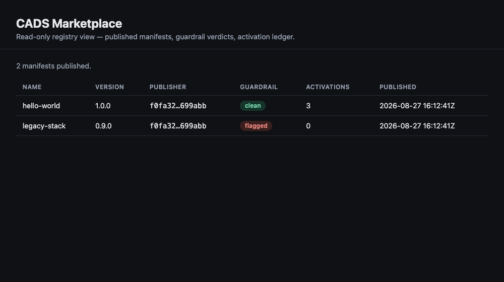

# Publish your first manifest

**Goal:** sign a bundle, publish it to a registry, watch the guardrail pass it — and reject a
hostile one — then see it on the admin dashboard. By the end you will have done the whole
supply-chain path once, and seen every step's real output.

**Before:** a checkout of [`scimbe/CADS-agent-marketplace`](https://github.com/scimbe/CADS-agent-marketplace)
and a Rust toolchain. **No Docker daemon is required** for anything on this page.

!!! info "Everything on this page is measured"
    Every command below was run on a macOS host with no Docker daemon on 2026-08-27, against the
    marketplace at `d09eecd`. The output blocks are copied verbatim from that run.

---

## 1 — Start a registry

The registry is a small axum + SQLite service. It fails loud on missing configuration rather
than guessing — so you set four environment variables and run it:

```bash
export REGISTRY_BIND_ADDR=127.0.0.1:8787
export REGISTRY_DB_PATH=./registry.db
export REGISTRY_BUNDLES_DIR=./bundles
export REGISTRY_WRITE_TOKEN=s3cr3t-write-token   # required on every write
cargo run -p registry
```

It prints `registry listening on 127.0.0.1:8787` and an empty catalogue answers at
`GET /manifests`.

---

## 2 — Sign a manifest

A manifest is ed25519-signed by your **holder key** — the same key family a ct-agent already
uses for channel membership. The `dev_sign` example builds and signs one from environment
variables (the production `ct-agent manifest` CLI takes the same fields):

```console
$ export CT_MANIFEST_HOLDER_KEY=<your holder key>   # ed25519, 64 hex
$ cargo run --quiet --example dev_sign > hello-world.manifest.json
$ jq '{name,version,installer_kind,publisher_pubkey,signature}' hello-world.manifest.json
{
  "name": "hello-world",
  "version": "1.0.0",
  "installer_kind": "compose",
  "publisher_pubkey": "f0fa325954c3761b…",
  "signature": "a7d5a33f987a7569469cd7563cc1d198…"
}
```


The private key never leaves your machine; the manifest carries only the **public** half plus
the signature.

---

## 3 — Publish it

Publishing is a `multipart/form-data` POST with two parts: the signed `manifest` JSON and the
`bundle` tarball. The registry verifies the signature, confirms the uploaded bytes match the
manifest's signed `sha256`, **and** guardrail-scans the compose file — all before it stores
anything.

```console
$ curl -sS -X POST http://127.0.0.1:8787/manifests \
    -H "Authorization: Bearer $WRITE_TOKEN" \
    -F manifest=@hello-world.manifest.json \
    -F bundle=@hello-world-bundle.tar.gz
{"manifest_id":"aa11aa11aa11aa11aa11aa11aa11aa11aa11aa11aa11aa11aa11aa11aa11aa11","guardrail_verdict":"clean"}
```


`clean` means the scanner found nothing that would let the service escape its own bundle. The
manifest is now catalogued.

!!! warning "The verdict is not the same as the signature"
    A valid signature only proves *who* signed. `clean` is a separate judgement about *what* the
    bundle would do. Both must pass. See [The trust model](../explanation/the-trust-model.md).

---

## 4 — Watch the guardrail reject a hostile bundle

Now publish a bundle whose compose file asks for everything a container should not have —
`privileged: true`, host networking, a world-exposed port, and the host's `/etc` mounted in.
The signature is perfectly valid; the bundle is not.

```console
$ # same call — but this bundle's compose file is hostile
$ curl -sS -X POST .../manifests -F manifest=@legacy-stack.manifest.json -F bundle=@legacy-stack.tar.gz
{
  "manifest_id": "bb22bb22bb22\u2026",
  "guardrail_verdict": "evil[F.1-non-loopback-port]: String(\"0.0.0.0:9999:9999\"); evil[F.2-privileged]: privileged: true; evil[F.2-host-namespace]: network_mode: host; evil[F.3-host-path-escapes-bundle]: /etc -> /etc (outside the bundle)"
}
```


Four independent violations, each named. The manifest is still recorded — with its verdict — so
the catalogue keeps a permanent account of *why* it was flagged. What a flagged manifest may then
do at activation time is the [trust model](../explanation/the-trust-model.md)'s job, not the
scanner's.

---

## 5 — Fetch it back

A published manifest reads back byte-identical to what you signed, and its bundle's hash still
matches the signed value:

```console
$ # fetch the manifest back — byte-identical to what was signed
$ curl -s http://127.0.0.1:8787/manifests/aa11aa11aa11aa11aa11aa11aa11aa11aa11aa11aa11aa11aa11aa11aa11aa11 | jq '{name,version,guardrail:.guardrail_verdict}'
{
  "name": "hello-world",
  "version": "1.0.0",
  "guardrail_verdict": "clean"
}

$ # the bundle's sha256 matches the manifest's signed value exactly
$ curl -s .../manifests/aa11aa11aa11aa11aa11aa11aa11aa11aa11aa11aa11aa11aa11aa11aa11aa11/bundle | sha256sum
  fetched bundle : 594c554b7c6925c3038f8430dfa3993ef5c26d4e1c9682d52ed004b7000ed587
  signed  sha256 : 594c554b7c6925c3038f8430dfa3993ef5c26d4e1c9682d52ed004b7000ed587
  → match ✓
```


---

## 6 — The activation ledger

Every activation appends one record; the publisher ledger sums them per manifest. No payment
provider is called — this is a ledger, not a checkout.

```console
$ # each activation appends one ledger record; the publisher ledger sums them
$ curl -s .../publishers/$PUB/ledger | jq
[
    {
        "manifest_id": "bb22bb22bb22bb22bb22bb22bb22bb22bb22bb22bb22bb22bb22bb22bb22bb22",
        "name": "legacy-stack",
        "version": "0.9.0",
        "activation_count": 0
    },
    {
        "manifest_id": "aa11aa11aa11aa11aa11aa11aa11aa11aa11aa11aa11aa11aa11aa11aa11aa11",
        "name": "hello-world",
        "version": "1.0.0",
        "activation_count": 3
    }
]
```


---

## 7 — What the gate refuses

Two things the registry will not do, so you can see the boundary:

```console
$ # publish with no bearer token
  HTTP 401  → rejected

$ # valid signature, but the uploaded bundle bytes were tampered with
  HTTP 400  refusing to publish: uploaded bundle bytes do not match the manifest's own signed bundle.sha256
```


A missing token is refused before anything is read; a tampered bundle is refused because its
bytes no longer match the signature's own `sha256`.

---

## 8 — See it on the dashboard

The Phase 4 admin view is a read-only window on the registry. Pointed at the registry you just
populated, it shows both manifests with their verdict badges and activation counts — the
registry's own values, not mock data:



Hovering a **flagged** badge reveals every violation from step 4.

---

## What you can do now

You have run the whole path once: **sign to publish to scan to fetch to activate to view**. Every
deterministic part of that worked with no container runtime present.

Two directions from here:

- To actually *bring a service up* from a compose bundle, you need a Docker daemon — that step is
  real but was not run on this host. See [Installer kinds](../reference/installer-kinds.md).
- To let a bounded local model maintain a bundle's own code, see
  [The harness and its cage](../explanation/the-harness-cage.md) — the most complex piece, and the
  one whose containment is worth proving carefully.
